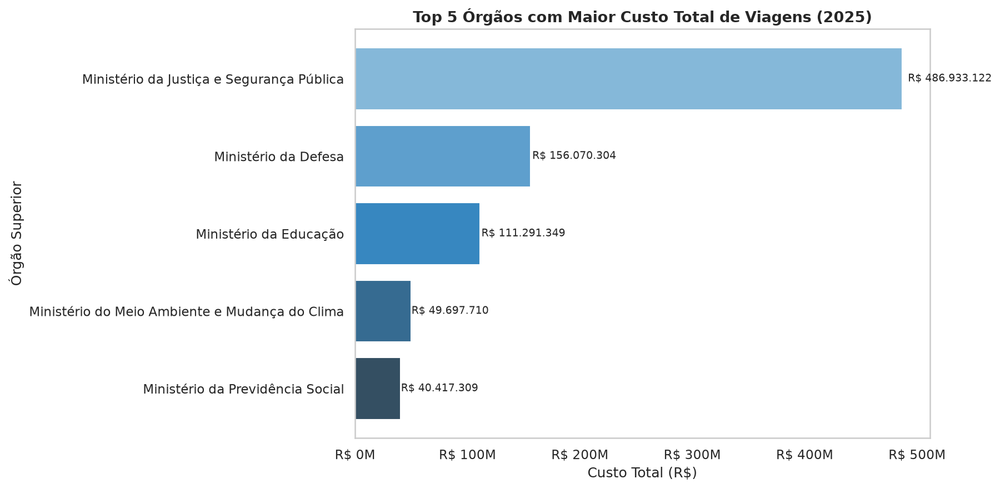
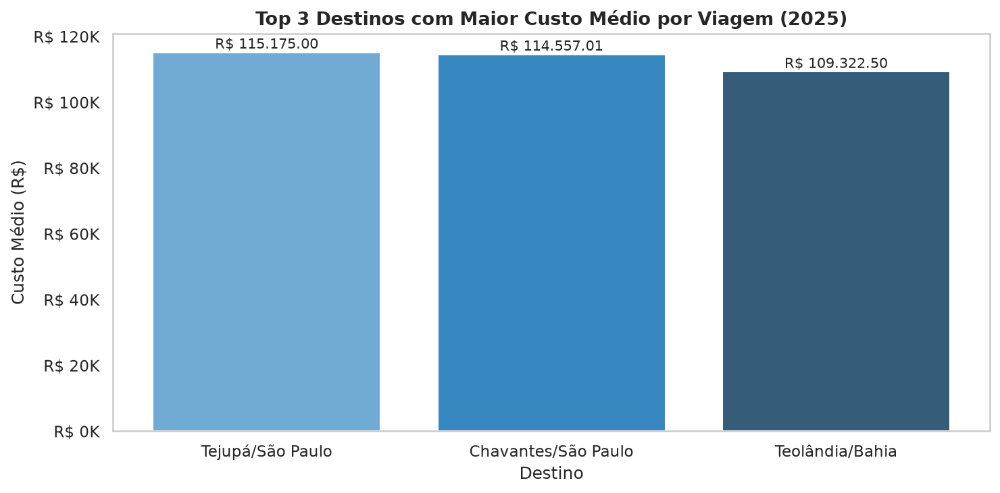
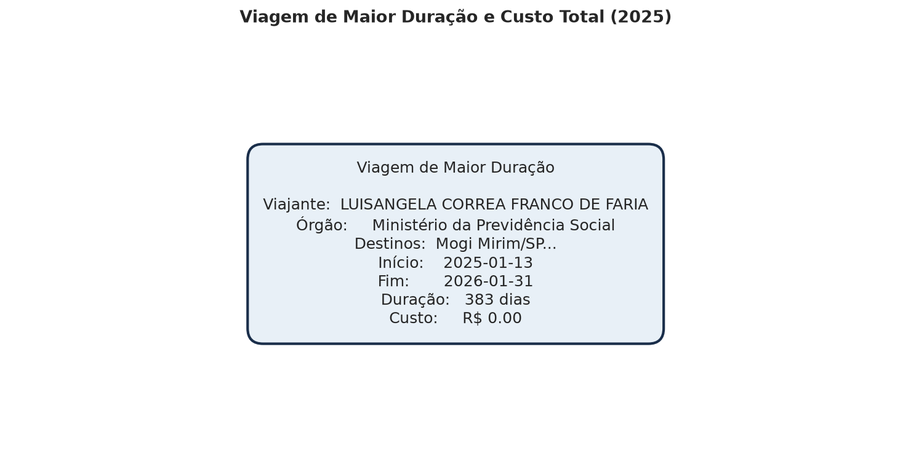
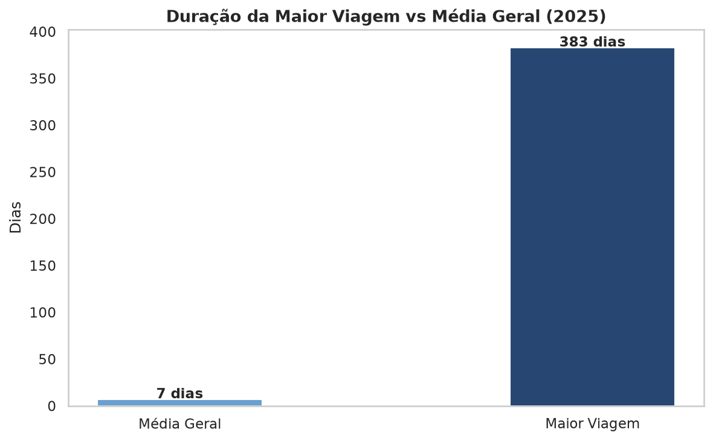
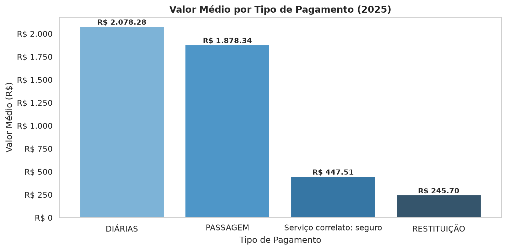
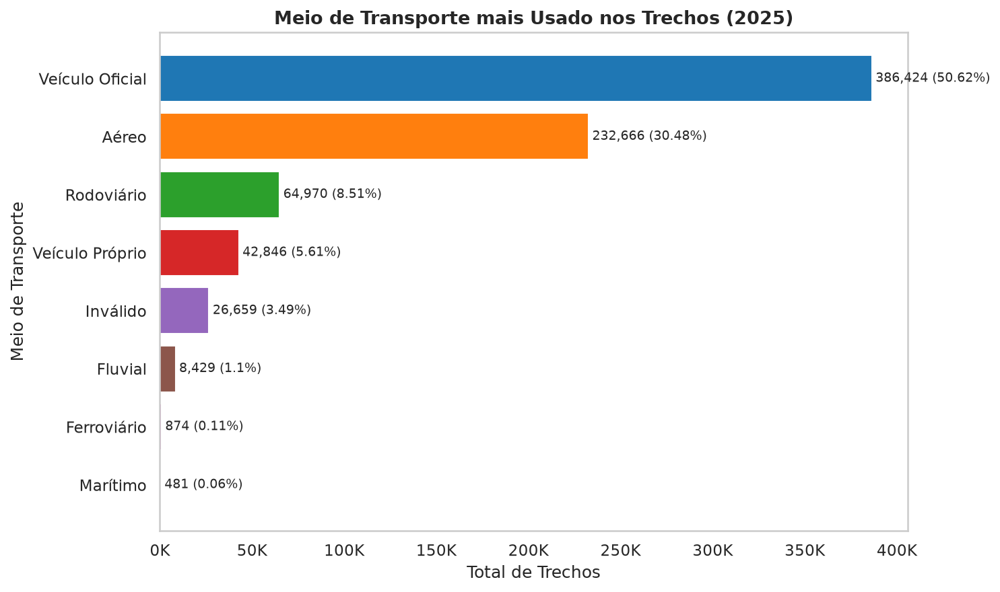
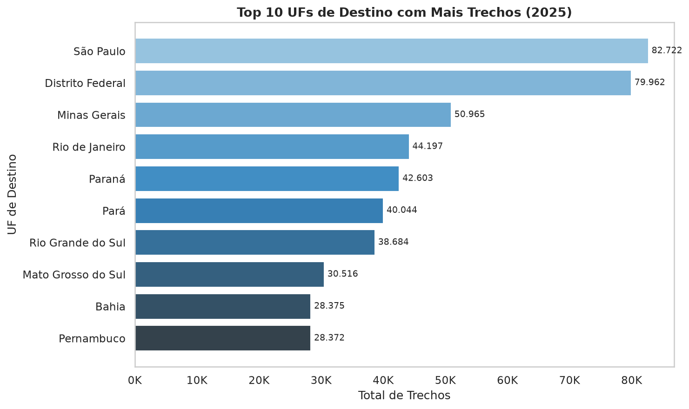
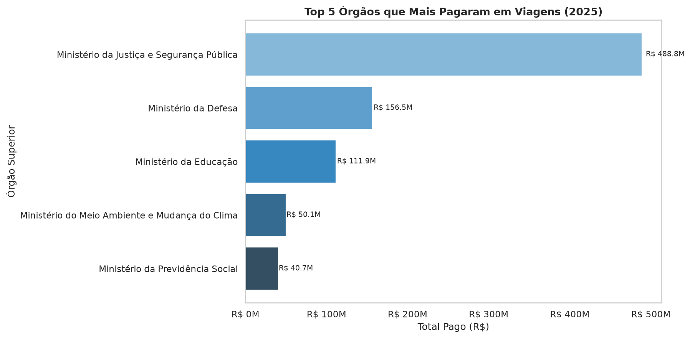

## AUTOR: Rodrigo Maduell Fonseca
## TURMA: Análise de Dados com Python - T2 - 2026
## INSTITUIÇÃO: SCTEC/SENAI-SC 

## NOME PROJETO: Pipeline de dados - viagens a serviço 
## ORIGEM DADOS: Portal da Transparência do Governo Federal


## DESCRIÇÃO DO PROJETO:

Pipeline de dados criado do zero para extrair, limpar e analisar dados públicos de 'Viagens a Serviço' retirados do Portal da Transparência do Governo Federal.

O projeto visa transformar dados brutos em métricas claras para tomada de decisão.

### Arquitetura Medallion

Este projeto segue a Arquitetura Medallion com três camadas progressivas de qualidade: 

RAW >>> SILVER >>> GOLD

🥉 Raw: Cópia fiel dos CSVs, todas as colunas VARCHAR
Tabelas: raw_viagem, raw_pagamento, raw_passagem, raw_trecho

🥈 Silver: Dados tipados, limpos e com integridade referencial 
Tabelas: silver_viagem, silver_pagamento, silver_passagem, silver_trecho

🥇 Gold: Agregações e métricas prontas para análise
Tabelas: gold_resumo_orgaos + views analíticas


## TÉCNOLOGIAS UTILIZADAS

- **Python 3.12** — linguagem principal
- **Pandas** — manipulação e transformação de dados
- **MySQL** — banco de dados relacional
- **mysql-connector-python** — integração Python + MySQL
- **Matplotlib / Seaborn** — visualização de dados
- **Jupyter Notebook** — análise exploratória e camada Gold
- **Git / GitHub** — versionamento do projeto


## ESTRUTURA DO PROJETO

pipeline-transparencia/
├-- config.py            # Parâmetros e leitura do .env
├-- banco.py             # Conexão e funções utilitárias do MySQL
├-- .env.example         # Modelo de credenciais (copie para .env)
├-- .gitignore           # Arquivos ignorados pelo Git
├-- requirements.txt     # Dependências do projeto
|-- README.md            # Descrição do projeto / Instruções
├-- 0_criar_banco.sql    # Criação do banco e das 8 tabelas
├-- 1_extrair.py         # Download + carga na camada Raw
├-- 2_transformar.py     # Limpeza e tipagem (Raw >>> Silver)
└-- 3_analise.ipynb      # Camada Gold + perguntas de negócio + gráficos


## COMO EXECUTAR

### 1. Clonar o repositório
```bash
git clone https://github.com/rodrigomaduell/pipeline-transparencia.git
cd pipeline-transparencia
```

### 2. Criar e ativar o ambiente virtual
```bash
python3 -m venv venv
source venv/bin/activate
```

### 3. Instalar dependências
```bash
pip install -r requirements.txt
```

### 4. Configurar credenciais
```bash
cp .env.example .env
# Edite o arquivo .env com suas credenciais do MySQL
```

### 5. Executar o pipeline na ordem
```bash
# Criar banco e tabelas
mysql -u root -p < 0_criar_banco.sql

# Extração e carga Raw
python 1_extrair.py

# Transformação e carga Silver
python 2_transformar.py

# Análise Gold (abrir no Jupyter)
jupyter notebook 3_analise.ipynb
```

## PERGUNTAS DE NEGÓCIO

1. Quais os 5 órgãos com maior custo total de viagens?


2. Quais os 3 destinos com maior custo médio por viagem?
3. Qual a viagem de maior duração e seu custo total?
4. Qual o tipo de pagamento com maior valor médio?
5. Qual o meio de transporte mais usado nos trechos?
6. Qual a UF de destino que aparece em mais trechos?
7. Qual órgão pagou mais no total?

> Os resultados, gráficos e insights estão detalhados no notebook '3_analise.ipynb'.


## INSIGHTS

## 💡 Insights

### Órgãos e Gastos
- O **Ministério da Justiça e Segurança Pública** lidera com folga o ranking de gastos, com mais de **R$ 486 milhões** em viagens — mais que o dobro do segundo colocado. Isso reflete a natureza operacional do órgão, com agentes e servidores em campo constantemente.

### Destinos
- Os destinos com maior custo médio por viagem são cidades de pequeno porte no interior de São Paulo e Bahia, sugerindo que viagens para localidades de difícil acesso ou com menor infraestrutura tendem a ser mais caras.
- Optou-se por analisar destinos via tabela `silver_trecho` com JOIN, pois o campo `destinos` da `silver_viagem` agrega múltiplas cidades em uma única string, impossibilitando análise granular por destino individual.

### Duração
- A viagem de maior duração registrou **383 dias** com custo total de **R$ 0,00** — um caso atípico que indica possível erro de cadastro ou viagem sem reembolso registrado.
- A duração média geral das viagens é significativamente menor, o que confirma que esse registro é um outlier.

### Pagamentos
- **Diárias** representam o tipo de pagamento com maior valor médio (**R$ 2.078**), seguido de passagens (**R$ 1.878**).
- A **RESTITUIÇÃO** aparece com valor médio baixo (**R$ 245**), indicando devoluções pontuais de valores pagos a mais.

### Transporte
- **Veículo Oficial** é o meio de transporte mais usado com **50,6%** dos trechos — mais que todos os outros meios combinados.
- O transporte **Aéreo** representa **30,5%**, sendo predominante em viagens de maior distância e custo.

### Destinos por UF
- **São Paulo** e **Distrito Federal** lideram como UFs de destino, concentrando juntos quase **22%** de todos os trechos — reflexo da concentração de sedes corporativas e do governo federal nessas localidades.

## Perguntas de Negócio Respondidas

---

### 1. Os 5 órgãos com maior custo total?

| Órgão|---------------------------------------------------------------|Custo Total |

| Ministério da Justiça e Segurança Pública |--------------------------| R$ 486.933.121,65 |
| Ministério da Defesa |-----------------------------------------------| R$ 156.070.304,49 |
| Ministério da Educação |---------------------------------------------| R$ 111.291.349,34 |
| Ministério do Meio Ambiente e Mudança do Clima |---------------------| R$ 49.697.710,16 |
| Ministério da Previdência Social |-----------------------------------| R$ 40.417.309,06 |



---

### 2. Os 3 destinos com maior custo médio por viagem?

| Destino |--------| Total Viagens |-----------------| Custo Médio |

| Tejupá/SP |------|             1 |-----------------| R$ 115.175,00 |
| Chavantes/SP |---|             1 |-----------------| R$ 114.557,01 |
| Teolândia/BA |---|             1 |-----------------| R$ 109.322,50 |



---

### 3. A viagem de maior duração e seu custo total?

| Viajante                    | LUISANGELA CORREA FRANCO DE FARIA |
| Órgão                       | Ministério da Previdência Social |
| Início                      | 13/01/2025 |
| Fim                         | 31/01/2026 |
| Duração                     | 383 dias |
| Custo Total                 | R$ 0,00 |




---

### 4. Qual o tipo de pagamento com maior valor médio?

| Tipo de Pagamento          | Total      | Valor Médio     | Valor Total |

| Diárias                    | 401.463    | R$ 2.078,28     | R$ 834.352.643,52 |
| Passagem                   | 188.985    | R$ 1.878,34     | R$ 354.978.915,13 |
| Serviço correlato: seguro  | 4.894      | R$ 447,51       | R$ 2.190.136,71 |
| Restituição                | 11.574     | R$ 245,70       | R$ 2.843.762,01 |



---

### 5. Qual o meio de transporte mais usado nos trechos?

| Meio de Transporte      | Total Trechos     | Percentual |

| Veículo Oficial         | 386.424           | 50,62% |
| Aéreo                   | 232.666           | 30,48% |
| Rodoviário              | 64.970            | 8,51% |
| Veículo Próprio         | 42.846            | 5,61% |
| Inválido                | 26.659            | 3,49% |
| Fluvial                 | 8.429             | 1,10% |
| Ferroviário             | 874               | 0,11% |
| Marítimo                | 481               | 0,06% |



---

### 6. Qual UF de destino aparece em mais trechos?

| UF                  | Total Trechos    | Percentual |

| São Paulo           | 82.722           | 11,05% |
| Distrito Federal    | 79.962           | 10,68% |
| Minas Gerais        | 50.965           | 6,81% |
| Rio de Janeiro      | 44.197           | 5,90% |
| Paraná              | 42.603           | 5,69% |



---

### 7. Qual órgão pagou mais no total?

| Órgão                                             | Total Viagens            | Total Pago |

| Ministério da Justiça e Segurança Pública         | 75.633                   | R$ 488.831.110,61 |
| Ministério da Defesa                              | 61.388                   | R$ 156.549.767,91 |
| Ministério da Educação                            | 60.011                   | R$ 111.897.434,35 |
| Ministério do Meio Ambiente e Mudança do Clima    | 13.397                   | R$ 50.123.043,80 |
| Ministério da Previdência Social                  | 7.911                    | R$ 40.659.494,63 |



---

## 💡 Insights

- O **Ministério da Justiça e Segurança Pública** lidera tanto em custo total quanto em pagamentos, com mais de **R$ 486 milhões** — reflexo da natureza operacional do órgão com agentes em campo continuamente.
- Os destinos com maior custo médio são cidades de pequeno porte no interior de SP e BA, sugerindo que localidades de difícil acesso geram viagens significativamente mais caras.
- A viagem de maior duração registrou **383 dias** com custo de **R$ 0,00** — um outlier que indica possível erro de cadastro ou viagem sem reembolso registrado.
- **Diárias** representam o maior valor médio por pagamento (R$ 2.078), superando passagens (R$ 1.878), o que sugere viagens longas com pernoite como padrão predominante.
- **Veículo Oficial** é o meio de transporte mais usado com **50,62%** dos trechos, indicando que a maior parte dos deslocamentos é de curta distância dentro do mesmo estado ou região.
- **São Paulo** e **Distrito Federal** concentram quase **22% de todos os trechos**, refletindo a concentração de sedes corporativas e do governo federal nessas localidades.
- Para a análise de destinos optou-se por utilizar a tabela `silver_trecho` via JOIN com `silver_viagem`, pois o campo `destinos` da tabela de viagens agrega múltiplas cidades em uma única string, impossibilitando análise granular por destino individual.
